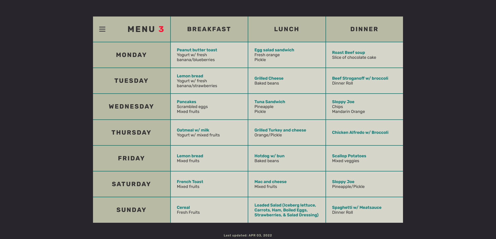

<h1 align="center">MGH Menu</h1>

<h3 align="center">Deployed via Netlify</h3>

<a href="https://mghmenu.netlify.app/">https://mghmenu.netlify.app/</a>

  
Table of Contents

  <ol>
    <li>
      <a href="#about-the-project">About The Project</a>
      <ul>
        <li><a href="#built-with">Built With</a></li>
        <li><a href="#resources-involved">Resources Involved</a></li>
      </ul>
    </li>
    <li><a href="#purpose">Purpose</a></li>
    <li><a href="#usage">Usage</a></li>
    <li><a href="#roadmap">Roadmap</a></li>
    <li><a href="#contact">Contact</a></li>
  </ol>

## About The Project

This project allows the user to view/submit weekly menus.

(<a href="#top">back to top</a>)

#### Built With

&nbsp;&nbsp; <code></code> &nbsp; HTML

&nbsp;&nbsp; <code></code> &nbsp; CSS

&nbsp;&nbsp; <code></code> JavaScript

#### Resources Involved

<a href="https://formsubmit.co/">https://formsubmit.co/</a> 
This allows the submission form to automatically send new menus directly to my email without needing to open up an email client and having the user expose their own email address.

(<a href="#top">back to top</a>)

## Purpose

The RN's/staff likes to write down their menus for both facilities. This led to inconsistencies where one location may have a completely new menu and/or an altered one. To alleviate grocery issues, this site was made to provide a single source that anyone may easily access. On top of viewing menus, users can create and submit their own menus. All submissions are automatically emailed for review.

(<a href="#top">back to top</a>)

## Usage

When submitting a new menu, all inputs will be arranged and translated into a source code that will be emailed to me. After submission review, the emailed code can easily be copy/pasted and implemented without wasting time trying to format correctly.

(<a href="#top">back to top</a>)

## Roadmap:

- [ ] Add hover effects to respective day/mealtime on menu hover.
- [ ] Create media queries (low priority: all staff mainly use desktop).
    - [x] Desktop
    - [ ] Laptop
    - [ ] Tablet
    - [ ] Phone (large)
    - [ ] Phone (small)
- [ ] Fix issue where printing page keeps format, but does not show grid stylings.

(<a href="#top">back to top</a>)

## Contact

Andrew Kohn - [Twitter](https://twitter.com/andrewkohn_dev) - [E-mail](mailto:andy@akohn.dev)

Project Link: https://github.com/AndrewKohn/MGH-menu

(<a href="#top">back to top</a>)

